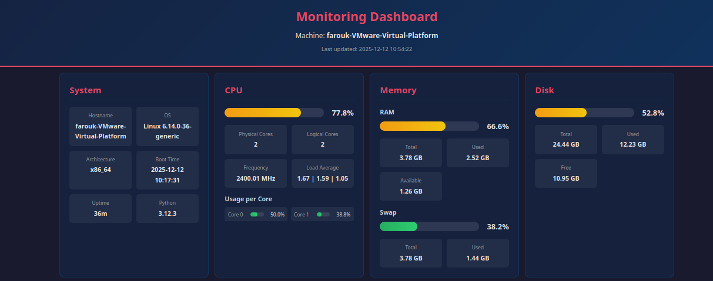
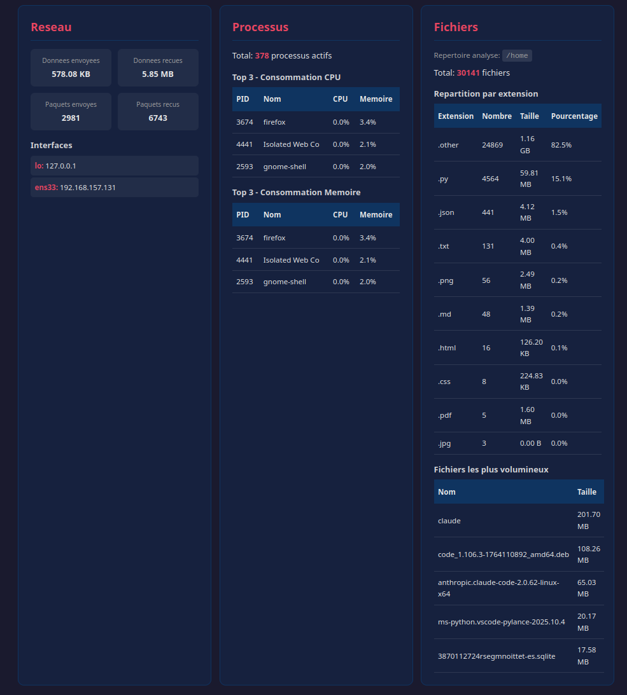
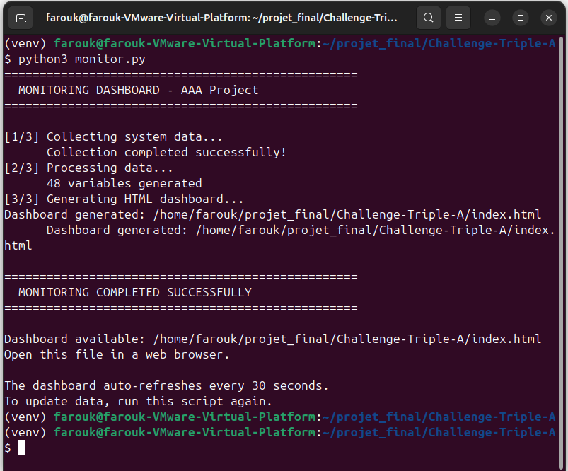

# AAA Project - Linux Monitoring Dashboard

[](https://www.python.org/)

Real-time monitoring dashboard for Ubuntu virtual machine.

## Screenshots

### Dashboard Overview


### Detailed Metrics


### Terminal Output


## Description

This project monitors system resources of a Linux VM and displays information in a static web dashboard that automatically refreshes.

### Features

- **System**: Hostname, OS, architecture, uptime
- **CPU**: Global and per-core usage, load average
- **Memory**: RAM and Swap (usage, available)
- **Disk**: Used/free space
- **Network**: Sent/received data, interfaces
- **Processes**: Top 3 by CPU and memory
- **Files**: Analysis by extension, largest files

## Prerequisites

- Ubuntu Desktop 22.04 LTS (or newer)
- Python 3.8+
- pip3

## Installation

```bash
# 1. Clone the project
git clone <repo-url>
cd Challenge-Triple-A

# 2. Create virtual environment
python3 -m venv venv
source venv/bin/activate

# 3. Install dependencies
pip install -r requirements.txt
```

## Usage

```bash
# Run monitoring (generates index.html)
python monitor.py

# Available options
python monitor.py --help
python monitor.py --directory /home/user/Documents
python monitor.py --output dashboard.html
python monitor.py --template custom_template.html
python monitor.py --verbose
```

Open `index.html` in a web browser. The page automatically refreshes every 30 seconds.

## Architecture

The project follows a layered architecture for modularity:

```
Challenge-Triple-A/
├── src/
│   ├── __init__.py
│   ├── api/                 # API Layer (HTML generation)
│   │   ├── __init__.py
│   │   └── html_generator.py
│   ├── core/                # Core Layer (business logic)
│   │   ├── __init__.py
│   │   └── data_processor.py
│   └── data/                # Data Layer (system access)
│       ├── __init__.py
│       └── system_collector.py
├── tests/
│   ├── __init__.py
│   └── test_main.py
├── screenshots/             # Dashboard screenshots
│   ├── dashboard1.png
│   ├── dashboard2.png
│   └── terminal.png
├── monitor.py               # Main script
├── template.html            # HTML template with variables
├── template.css             # CSS styles with gauges
├── index.html               # Generated dashboard (gitignore)
├── requirements.txt         # Python dependencies
├── .gitignore
└── README.md
```

### Layers

| Layer | Role | Module |
|-------|------|--------|
| **Data** | Data collection via psutil | `system_collector.py` |
| **Core** | Data processing and formatting | `data_processor.py` |
| **API** | Variable substitution in template | `html_generator.py` |

## Color Indicators

Gauges use a color code based on thresholds:

| Color | Range | Meaning |
|-------|-------|---------|
| Green | 0-50% | Normal |
| Orange | 51-80% | Warning |
| Red | 81-100% | Critical |

## Technologies

- **Python 3**: Main language
- **psutil**: System data collection library
- **HTML5**: Semantic structure
- **CSS3**: Styles with Flexbox/Grid, animated gauges

## Contributing

Contributions are welcome! Feel free to open an issue or pull request.

## License

Educational project - Free to use
